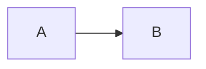

# darenkeck

Frontend-only Vite + React + TypeScript app for the next version of the darenkeck landing page.

## Local development

1. Create `apps/darenkeck/.env` with:

   ```bash
   VITE_COMBO_API_BASE_URL=<your-api-base-url>
   ```

2. Start dev server:

   ```bash
   bun run content:darenkeck:prepare
   bun run --cwd apps/darenkeck dev
   ```

## Dev proxy note (important)

- In development, Vite proxies requests from `/public/*` to `VITE_COMBO_API_BASE_URL`.
- This avoids browser CORS errors from `http://localhost:3002`.
- This proxy behavior is **dev-only** and does not exist in production builds.
- If you change `.env` or `vite.config.ts`, restart the dev server.

## Blog content

Blog entries live in the separate `darenkeck-content` repository under `content/posts/`. Each Markdown file requires frontmatter:

```markdown
---
title: Post title
date: 2026-08-10
slug: optional-custom-slug
summary: Optional index and metadata summary (excerpt is also accepted)
draft: false
---
```

The content preparation step validates metadata, rejects duplicate slugs, sorts posts newest-first, and writes an ignored generated manifest. Entries with `draft: true` are omitted completely from that manifest and the production bundle. Files ending in `-draft.md` are also excluded as a safety fallback.

## Mermaid diagrams at build time

The site does not render Mermaid in the browser. Use fenced `mermaid` blocks directly in published blog Markdown, or keep standalone `.mmd` source in the `darenkeck-content` repository under `diagrams/`. Content preparation extracts published-post blocks and renders every source with the pinned Mermaid CLI into ignored static assets under `public/media/diagrams/`.

Fenced blog diagrams are rewritten to deterministic paths:

````markdown


-> /media/diagrams/posts/<post-slug>/diagram-1.svg
````

Standalone sources preserve relative paths:

```bash
diagrams/posts/upload-flow.mmd -> /media/diagrams/posts/upload-flow.svg
```

Reference the generated SVG from Markdown:

```markdown

```

`bun run content:darenkeck:build` generates the published blog manifest and all diagram SVGs from already-fetched content. The full `bun run content:darenkeck:prepare` workflow fetches content, builds posts and diagrams, then generates the resume PDF.

Draft-post Mermaid blocks are never rendered. The renderer uses Mermaid CLI `11.16.0`, the dark theme, a transparent background, and atomic output replacement. Images render without an added background, border, or padding. `public/media/diagrams/` is replaced on every preparation, so removed sources cannot leave stale SVGs. Invalid Mermaid fails the deployment. The first invocation may download the pinned authoring package and its headless-browser dependency.

Use `accTitle` and `accDescr` in Mermaid source where supported, and always provide useful Markdown alt text. Generated SVGs are not committed to either application source or the content repository.

## Static deploy (S3 + CloudFront)

Deployment model for this app is static hosting via S3 behind CloudFront.

### Environments

- **staging**: build with Vite `staging` mode and `VITE_COMBO_API_BASE_URL` for staging API
- **production**: build with Vite `production` mode and `VITE_COMBO_API_BASE_URL` for prod API

Use these templates:

- `apps/darenkeck/.env.staging.example`
- `apps/darenkeck/.env.production.example`

Create real env files (do not commit secrets):

- `apps/darenkeck/.env.staging`
- `apps/darenkeck/.env.production`

### Build commands

```bash
bun run build:darenkeck:staging
bun run build:darenkeck:prod
```

### Deploy outline

1. Fetch `darenkeck-content`.
2. Generate the published blog manifest, Mermaid SVGs, and resume PDF.
3. Build the target environment.
4. Upload `apps/darenkeck/dist` to the environment's S3 bucket.
5. Invalidate CloudFront cache.

Example AWS CLI shape:

```bash
aws s3 sync apps/darenkeck/dist s3://<bucket-name> --delete
aws cloudfront create-invalidation --distribution-id <distribution-id> --paths "/*"
```
