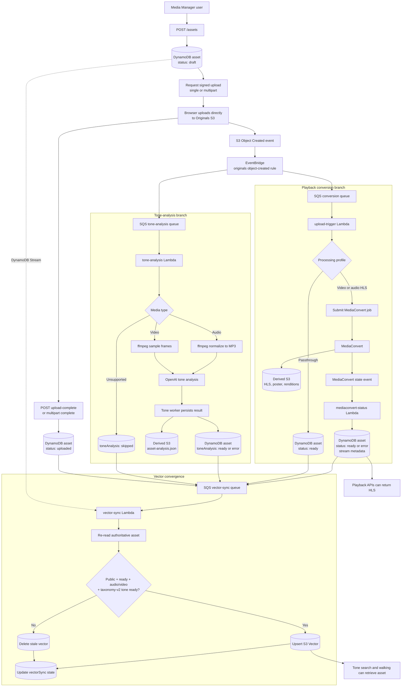

# Asset Upload and Processing Flow

This diagram follows an uploaded media asset from metadata creation through playback, tone analysis, and vector-search eligibility. DynamoDB is authoritative; S3 media and S3 Vectors are derived from that record.

## Dependency Summary

| Result              | Required completed steps                                                                                                                                                                      |
| ------------------- | --------------------------------------------------------------------------------------------------------------------------------------------------------------------------------------------- |
| Original stored     | Asset metadata exists and the browser upload to Originals S3 succeeds.                                                                                                                        |
| Upload confirmed    | The API verifies the S3 object and records its size/content type. This confirmation may race with async processing, so it does not overwrite a later `processing`, `ready`, or `error` state. |
| Playable asset      | The conversion branch reaches `ready` and writes stream metadata, or a valid passthrough profile reaches `ready`. Tone analysis is not required for playback.                                 |
| Tone-enriched asset | The independent tone worker completes OpenAI analysis and stores `toneAnalysis` metadata plus `derived/<assetId>/tone/asset-analysis.json`. Conversion does not need to be finished first.    |
| Searchable vector   | The authoritative asset is audio/video, public, playback-ready, and has complete ready `tone-taxonomy/v2` scores.                                                                             |

## Failure Boundaries

- Conversion and tone analysis use separate SQS queues and DLQs. A tone backlog or failure does not block conversion or playback.
- A conversion failure sets the top-level asset status to `error`; a tone failure changes only `toneAnalysis.status`.
- Workers append bounded lifecycle entries to `asset.auditLog` for upload, conversion, MediaConvert, and tone-analysis events.
- Vector messages contain only `assetId`. The vector worker always rereads DynamoDB, making retries and out-of-order messages converge safely.
- S3 Vectors contains only derived search records. Reconciliation can rebuild it from DynamoDB without re-uploading media.

## Primary Components

| Layer            | Components                                                                               |
| ---------------- | ---------------------------------------------------------------------------------------- |
| API              | `api-assets`, `api-asset-by-id`                                                          |
| Event routing    | Originals S3, EventBridge object-created rule                                            |
| Conversion       | `media-manager-upload-events` SQS, `upload-trigger`, MediaConvert, `mediaconvert-status` |
| Tone analysis    | `media-manager-tone-analysis` SQS, `tone-analysis`, ffmpeg Lambda layer, OpenAI          |
| Persistence      | Assets DynamoDB table, Originals S3, Derived S3                                          |
| Vector lifecycle | Assets DynamoDB Stream, vector-sync SQS, `vector-sync`, S3 Vectors `asset-tone-v1`       |

See also: [Architecture Map](architecture-map.md), [Deploy and Ops](deploy-and-ops.md), and [Tone Vector Dimensions](tone-vector-dimensions.md).
