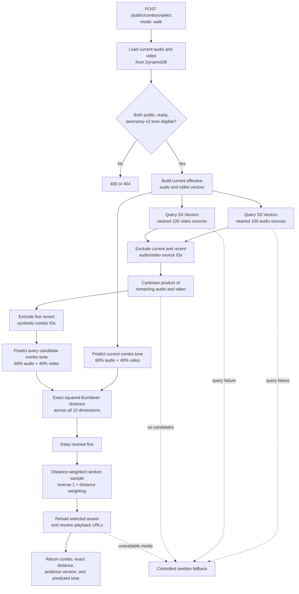

# Current Tone Walk Algorithm

The walk algorithm chooses a nearby audio/video combination after a current combination finishes. It uses S3 Vectors to retrieve plausible **source assets**, then predicts and ranks transient combinations in the selection Lambda. Combination vectors are never stored.

## End-to-End Flow



## Walk Request

The endpoint is:

```text
POST /public/combos/select
```

A walk request names the current source pair and supplies bounded client history:

```json
{
  "schemaVersion": "public-combo-selection-request/v1",
  "mode": "walk",
  "current": {
    "audioAssetId": "audio-current",
    "videoAssetId": "video-current"
  },
  "history": {
    "recentComboIds": ["public-video-audio"],
    "recentAudioAssetIds": ["audio-recent"],
    "recentVideoAssetIds": ["video-recent"]
  }
}
```

History limits are five combination IDs, three audio IDs, and three video IDs. Both current source IDs are always prohibited, so every successful walk changes both audio and video.

## Source Vectors

Each indexed source has one `asset-tone-vector/v1` record with ten `float32` values in canonical order:

```text
valence, arousal, dominance, warmth, tension,
intimacy, instability, nostalgia, beauty, menace
```

The effective source vector overlays sparse curator adjustments on the original model scores:

```text
effectiveTone = { ...modelScores, ...adjustedScores }
```

An asset is eligible for the index only when it is:

- Audio or video.
- Public.
- Playback status `ready`.
- Tone-analysis status `ready`.
- Analyzed with `tone-taxonomy/v2`.
- Complete across all ten dimensions.

DynamoDB remains authoritative. The vector convergence worker rereads the asset and either upserts its current effective vector or deletes a stale vector. The index is therefore derived and rebuildable.

## How S3 Vectors Is Used

The Lambda issues two filtered vector queries in parallel:

1. Current audio vector -> nearest audio source vectors.
2. Current video vector -> nearest video source vectors.

Each query uses the S3 Vectors index's Euclidean metric, filters by `assetType`, and requests up to 100 results. There is no source-distance cutoff. The adapter first obtains nearest keys with `QueryVectors`, then hydrates their canonical vector data and metadata with `GetVectors`.

The source-query distances are not the final recommendation score. They only bound the source candidate set. A farther individual source may still combine with its counterpart into a close predicted combination, so the application evaluates the full Cartesian product of the returned audio and video records.

At the current cap, the Lambda evaluates at most:

```text
100 audio sources * 100 video sources = 10,000 candidate pairs
```

S3 Vectors therefore avoids scanning and hydrating the full DynamoDB asset corpus while leaving combination logic in application code. The query adapter has a four-second timeout; a query failure triggers controlled random fallback rather than making vector availability a playback dependency.

## Combination Prediction

The current and candidate combinations use the same deterministic predictor:

```text
combo-tone-predictor/v0

comboTone[d] = clamp(
  0.60 * audioTone[d] +
  0.40 * videoTone[d]
)
```

Prediction happens only for the pairs needed by the request. There is no combination-vector table or combination-vector index.

## Exact Walk Ranking

After prediction, each candidate is compared with the current combination over all ten dimensions:

```text
distance(current, candidate) =
  sum((currentTone[d] - candidateTone[d])^2)
```

This exact squared-Euclidean score is calculated locally and sorted ascending. Unlike keyword search, walk ranking is not masked to selected dimensions and does not retain the original keyword query. The current combination alone is the tonal anchor.

The algorithm does not always choose rank one. It takes the nearest five valid candidates and samples with:

```text
weight = 1 / (1 + distance)
```

This keeps selection biased toward smaller tonal steps while allowing nearby variety and reducing deterministic loops.

## Exclusions

Before ranking, the algorithm removes:

- The current audio source.
- The current video source.
- Three recent audio sources.
- Three recent video sources.
- Five recent synthetic combination IDs.

Synthetic IDs use:

```text
public-<videoAssetId>-<audioAssetId>
```

The API enforces current-source exclusion independently of client history. Recent history is bounded so it cannot grow request size indefinitely or exclude the corpus permanently.

## Candidate Resolution

After sampling, the Lambda reloads both selected assets from DynamoDB with consistent reads. It verifies that they are still public and ready, resolves HLS or signed playback URLs, and returns:

- Video and audio IDs, titles, and playback URLs.
- `requestedMode="walk"` and `resolvedMode="walk"`.
- `combo-tone-predictor/v0`.
- The exact predicted-combo distance.
- The complete predicted tone when both authoritative source vectors remain available.

This final reload prevents stale vector-index state from returning private, deleted, or unplayable media.

## Controlled Random Fallback

Fallback occurs when vector retrieval fails, no walk candidates remain, the selected candidate becomes unavailable, or a search request has no candidates. For a walk, fallback uses three exclusion stages:

| Stage | Combination history | Recent source history | Current audio/video |
| ----- | ------------------- | --------------------- | ------------------- |
| 1     | Enforced            | Enforced              | Always excluded     |
| 2     | Relaxed             | Enforced              | Always excluded     |
| 3     | Relaxed             | Relaxed               | Always excluded     |

The fallback scans public ready assets, shuffles each source pool, and resolves the first valid pair. It may relax old history to preserve availability, but it never repeats either source from the current combination.

Fallback responses explicitly report `resolvedMode="random"` and one of these reasons:

- `vector_query_failed`
- `no_walk_candidates`
- `no_search_candidates`
- `selected_candidate_unavailable`

## Vector Database Boundaries

| S3 Vectors does                                       | S3 Vectors does not do                         |
| ----------------------------------------------------- | ---------------------------------------------- |
| Store one effective vector per eligible source asset. | Store or precompute combination vectors.       |
| Filter retrieval by audio or video type.              | Apply client history exclusions.               |
| Return a bounded nearest-source candidate set.        | Compute the 60/40 combination prediction.      |
| Reduce DynamoDB reads and pair-generation scope.      | Perform final combination ranking or sampling. |
| Remain rebuildable from authoritative asset records.  | Own visibility, readiness, or review truth.    |

## Search Versus Walk

The same endpoint also supports `mode="search"`, but search and walk have different anchors:

| Mode   | Anchor                                      | Vector retrieval                                           | Exact ranking                                                 |
| ------ | ------------------------------------------- | ---------------------------------------------------------- | ------------------------------------------------------------- |
| Search | Sparse tone query built from selected words | Direct and target-conditioned complementary source queries | Masked distance over requested dimensions                     |
| Walk   | Current audio and video source vectors      | Nearest sources of each matching type                      | Full ten-dimension distance from current predicted combo tone |

Search establishes a new starting point. Subsequent automatic transitions use the walk algorithm described here.

See also: [Tone Vector Dimensions](tone-vector-dimensions.md), [Upload Processing Flow](upload-processing-flow.md), [Architecture Map](architecture-map.md), and [Deploy and Ops](deploy-and-ops.md).
